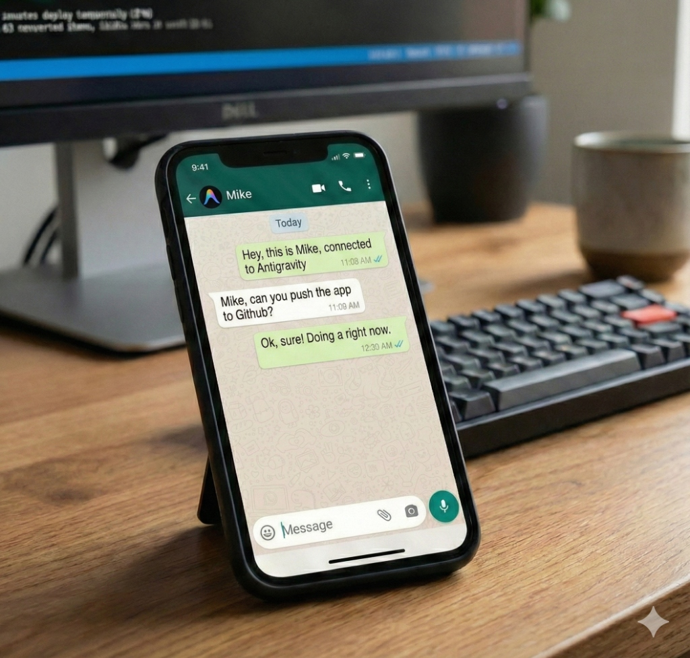

# Antigravity Bridge (Project Mike) 🚀🍌

**Your Desktop, controlled from WhatsApp.**

Antigravity Bridge is a powerful AI Agent that lives in your terminal and connects to WhatsApp. It allows you to chat with a Senior DevOps/Software Engineer (powered by Gemini 2.5) who has **real access** to your computer.

Mike can:
- 📂 **Explore** your file system.
- 📖 **Read & Write** code.
- 💻 **Execute Terminal Commands** (safely).
- 🎨 **Generate Images** (using Imagen 3).
- 👁️ **See** screenshots you send.
- 🗣️ **Listen** to voice notes.

## ⚠️ Warning
This bot has **filesystem and terminal access**. While it includes safety guardrails (blocking `rm`, `sudo`, etc. without confirmation), use it with caution and only connect it to your own WhatsApp account.

## prerequisites
- Node.js (v18+)
- A Google Gemini API Key (Get one at [aistudio.google.com](https://aistudio.google.com/))
- A WhatsApp account on your phone.

## Setup

1.  **Clone the repo:**
    ```bash
    git clone https://github.com/your-username/antigravity-bridge.git
    cd antigravity-bridge
    ```

2.  **Install dependencies:**
    ```bash
    npm install
    ```

3.  **Configure Environment:**
    Create a `.env` file in the root directory:
    ```ini
    GEMINI_API_KEY=your_api_key_here
    # Optional: Override the root directory the bot can access (defaults to parent folder)
    # PROJECT_ROOT=/Users/me/my-projects
    
    # 🔒 Privacy Whitelist (Recommended)
    # Comma-separated list of WhatsApp JIDs allowed to talk to Mike.
    # If set, Mike will IGNORE everyone else.
    # To find your JID, run the bot and send a message. The log will show: [SETUP_AID] JID: "1234..."
    # ALLOWED_JIDS=123456789@s.whatsapp.net
    ```

4.  **Run it:**
    ```bash
    node index.js
    ```

5.  **Connect WhatsApp:**
    - The terminal will display a QR Code.
    - Open WhatsApp on your phone -> Linked Devices -> Link a Device.
    - Scan the QR code.

6.  **Start Chatting!**
    - Say "Hola Mike!"
    - Try: *"Créame un archivo hello.txt"* or *"Dibújame un programador en el espacio"*.
    - **Stop Bot:** `!mike shutdown` (Este comando apaga el servicio completamente).

## 🛡️ Privacy & Security Modes
Mike has two modes of operation for privacy:

1.  **Strict Mode (Default if `ALLOWED_JIDS` is set)**:
    - Only responds to numbers in `ALLOWED_JIDS`.
    - Ignores everyone else completely.
    - No prefix needed for whitelisted users (Natural conversation).

2.  **Public/Open Mode (If `ALLOWED_JIDS` is empty)**:
    - Responds to ANYONE who sends a message starting with `!mike`.
    - Ignores messages without the prefix.
    - Useful if you want to share the bot in a group but control when it speaks.

## Project Structure
- `index.js`: The brain. Contains the connection logic, tool definitions, and Gemini loop.
- `artifacts/`: Stores generated images and session history.
- `baileys_auth_info/`: Stores your WhatsApp session keys (Not tracked by git).

## License
MIT
